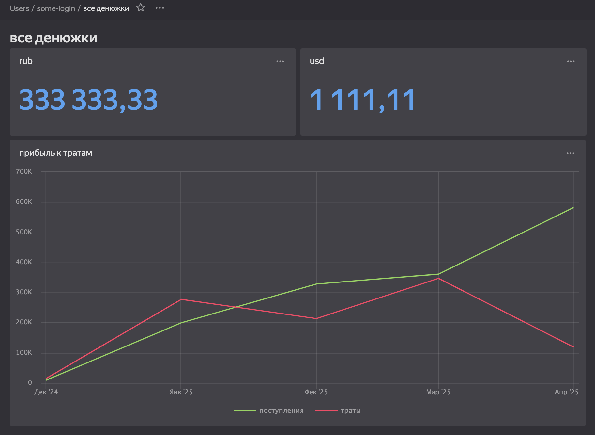
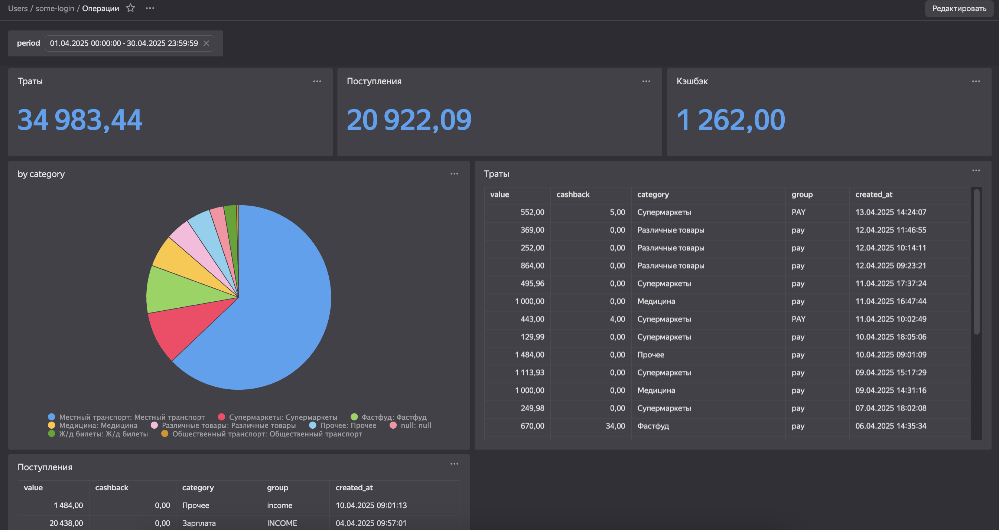
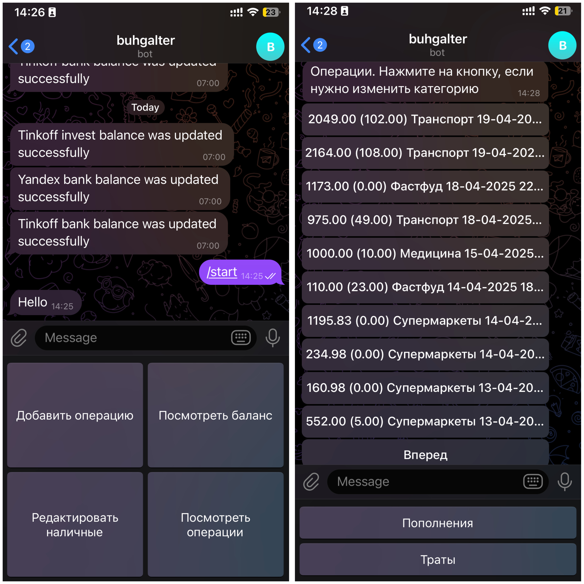

# Buhgalter - программа для ведения личных финансов

## Поддерживаемые банки
- Яндекс банк
- Т-Банк
- Т-Инвестиции (просмотр баланса)

## Функционал
### Datalense
*Доступен, если вы шарите базу во вне*  
*Шэринг настроек не доступен( Приложил скрины настроек чартов в папку img/datalanse*
- просмотр всех денег

- просмотр операций за период


### Телеграм бот (опционально)
Есть код для поднятия своего бота, через который можно:
- получать логи по обновлению баланса  
- просматривать текущий баланс
- смотреть траты и пополнения
- изменять категории по операциям  
- редактировать наличные
- добавлять операции  



## Предисловие

Использовать на свой страх и риск. В коде нет никаких бэкдоров для вытягивания ваших данных,
можете посмотреть сами. Но есть нюансик: если что-то пойдёт не так, то я не виноват, вы сами дураки.

## Как установить

```shell
git clone https://github.com/KonstantinAntoniadi/buhgalter.git
cd buhgalter
python3 -m pip install -r requirements.txt
```

## Как использовать

### 1. Настройка Vault
Нужен, чтобы не хранить все пароли в открытом виде у себя в папке/коде.  
Если хотите храните открыто, положите все креды в `creds` и замените в `buhgalter/modules/vault_client.py` результаты методов.

#### Установка
Я использовал [этот туториал](https://www.digitalocean.com/community/tutorials/how-to-securely-manage-secrets-with-hashicorp-vault-on-ubuntu-20-04).

Релизы vault можно достать [здесь](https://apt.releases.hashicorp.com/). Доступ только с VPN.  
Я использую версию `1.18.3`. Залил копию на [диск](https://disk.yandex.ru/d/nO9OQloLJVIOYg).

Адрес и токен от Vault положить в `creds/login_data.py`:
- `VAULT_URL`
- `VAULT_ROOT_TOKEN`

#### Система хранилища
Использую `key-value(kv)` со следующей структурой + примеры
- banks (все, что связано с банками)
    - owner_name_with_initial (Константин А.)
    - owner_phone_1 (+79999999999)
    - owner_phone_formatted_1 (+7 999 999-99-99)
    - tinkoff_card (5555555555555555) - когда первый раз тестил, писал сюда всякую чушь. Кажется можно обойтись и без нее.
    - tinkoff_invest_token (t.XXXXXXX) - токен для Т инвестиций. Дальше объясню, как его получить
    - tinkoff_password - пароль от тинька. Используется 1 раз для реги приложения
    - tinkoff_phone (79999999999) - для входа в Т-Банк. Писать только в таком формате
    - yandex_login - логин, для входа в Яндекс
- base64 (ключи для шифрования сессий)
    - tinkoff_bank
    - yandex_bank
- database (для подключения к БД)
    - db_host
    - db_name
    - db_password
    - db_port
    - db_user
- tg (все, что связано с Телеграмом)
    - tg_bot_token - токен от ТГ бота
    - tg_chat_id - ваш `id` в тг, чтобы бот мог общаться только с вами.

Вы спросите "А зачем несколько вариаций одного телефона, если можно использовать 1 и форматировать его в коде?". Вот и я не понимаю, почему так сделал...

### 2. Получение токена для Т инвестиций
*Если вам это не нужно, просто в `get_balance.py` закомментируйте `tinkoff_invest_updater`*.  
Подробно описано [тут](https://developer.tbank.ru/invest/intro/intro/token). Нужно получить **Read-only token**.

### 3. Настройка бота в ТГ
- Создание бота и получение токена [тут](t.me/BotFather). Бот нужен, чтобы войти в Яндекс Банк и получения информаций об успешных запусках программы. Если вам это не нужно, можете не настраивать.
- Получение своего `id` в Телеграм [тут](t.me/getmyid_bot)


### 4. Первый запуск
```python
python buhgalter/get_balance.py
```
После запуска:
- Т-Банк - потребуется ввести код из смс для входа в приложение.
- Яндекс Банк - отсканировать QR в output.png. Если настроен тг бот, то придет туда.
- Т-Инвестиции - ничего делать не нужно, авторизация по токену.


### 5. Запуск через крону
```bash
chmod +x get_balance.py
crontab -e
```

У меня такой пресет для запуска каждый день в 7 утра (МСК)
```bash
0 4  * * * /<path_to_project>/run_script.sh > /<path_to_project>/log.log 2>&1
```

## Логика работы
При запуске асинхронно собирается информация со всех источников - текущий баланс и **успешные** операции.
Операции между счетами тоже записываются, но помечаются флагом `is_between_owner_accounts`. Им же помечаются операции между Тиньком и Яндексом, чтобы они не отражались тратами.

Категории операций берутся из самого запроса. Альтернатива брать MCC. Категории по каждой операции можно изменить через ТГ бот.

Из тинька берутся операции за последние 10 дней.   
Из Яндекса столько, сколько придет в запросе. На данный момент это 30.   
Операция не проверяется на наличие в БД. На ID каждой операции есть уникальный ключ. При вставке такой же она просто не вставится.  

## Подробнее про код и авторизацию
### Т-Банк
Основывался на этом проекте - https://github.com/WhiteApfel/neolegoff_bank. Оставил нужное себе и пофиксил некоторые баги

#### Как работает
Прикидываемся телефоном и ходим в апи для мобилки. Локально сохраняем сессию и шифруем ее. Для этого нужно указать ключ шифрования в `base64/tinkoff_bank`. Пример `sdjfkljslkdf==`. После 1 авторизации повторная не требуется.

### Яндекс Банк
Делал на основе публичной АПИшки. Из-за этого раз в 3 дня нужно авторизовываться повторно. Потому что истекает время сессии. Можно настроить дамп операций реже и тогда входить в акк придется реже. Сессия так же хранится в зашифрованном виде. Ключ кладем в `base64/yandex_bank`.

Пробовал повторить вариант как с Т-Банком - прикидываться мобилкой и ходить в мобильное АПИ. Но там для авторизации нужен пин код, который отправляется на сервер в зашифрованном виде.


### Т-Инвестиции
Для получения баланса используется либа `tinkoff-investments`.  
Так же ее можно использовать для получения всех операций в Инвестициях. 

